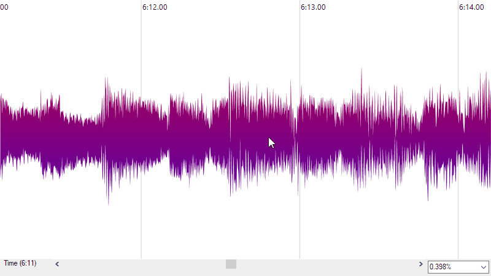

# WaveRenderer

Implementation of a waveform renderer in C#.

Uses a nested min/max for multi-resolution rendering allowing for zoom-in functionality.

For more information visit me at [elster.li](http://elster.li/wordpress/index.php/2020/11/27/rendering-zoomable-waveforms-efficiently/).